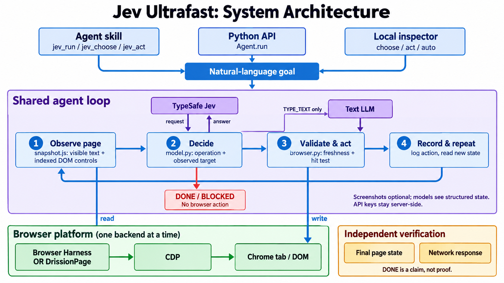
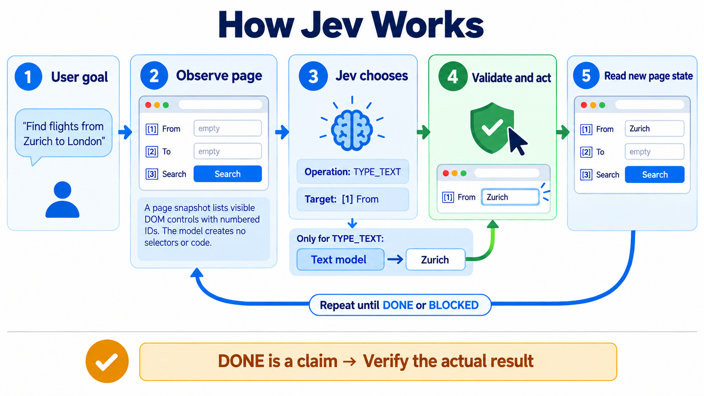

# Jev Ultrafast ⚡ browser-harness skill ⚡ DrissionPage

> Based on [browser-use/jev-ultrafast](https://github.com/browser-use/jev-ultrafast) (MIT, © Browser Use). This repository reorganizes it as a self-contained agent skill and adds an optional DrissionPage backend. The original license is kept in [LICENSE](LICENSE).

**Give a browser agent one goal. It reads a compact element table and acts in one model call per step.**

[TypeSafe's Jev](https://docs.typesafe.ai/introduction) picks an operation and a target element from an indexed table of the page's visible controls. A small text LLM writes text only when the operation is `TYPE_TEXT`. This repo ships the loop as a Python library, a local inspector, and an agent skill (`browser-jev-harness`) that runs the loop on a [Browser Harness](https://github.com/browser-use/browser-harness) tab or, optionally, on a [DrissionPage](https://github.com/g1879/DrissionPage) tab.

[Measurements](docs/performance.md) · [Read the loop](scripts/jev_ultrafast/agent.py)

> [!IMPORTANT]
> **Benchmark, 2026-09-24: owned tabs now open in their own window.** On Linux Chrome, a background tab in the user's window rendered no frames. CSS animations stayed pending, so Google Flights' ticket-type menu kept opacity 0 and never reached the element table. The run clicked the same button until it chose `BLOCKED`. Its own unfocused window renders normally.
>
> | Task (independently verified) | Baseline `f085130` | Baseline + own window | This version |
> | --- | --- | --- | --- |
> | Google Flights, one-way ZRH → LON | **2/5** passed · 12.6 s, 15.2 s · 20–21 decisions | 2/2 passed · 10.3 s, 11.1 s · 17–20 decisions | 1/1 passed · 11.3 s · 16 decisions |
> | Wikipedia, open Gödel article | 2/2 · 4.4 s, 21.0 s | 1/1 · 5.3 s | 1/1 · 4.1 s |
> | Local hotel search + filters | 3/3 · 3.9 s, 4.1 s, 7.8 s | — | 2/2 · 3.8 s, 4.4 s (before the window change) |
>
> Small sample, one machine, TypeSafe at ~0.5 s per decision from this network. The text helper was `gemini-2.5-flash-lite` on a free tier, which took 1–17 s per call and caused the 21.0 s and 7.8 s outliers. Fifteen further runs hit its quota (HTTP 429). They are excluded here but kept with every run's timings in [docs/window-fix-measurement.json](docs/window-fix-measurement.json). The Flights failures are the reliability result. The timing differences are within noise and are **not** a speed claim.



## Contents

- [Quick start](#quick-start)
- [Use it as a skill](#use-it-as-a-skill)
- [Use it as a library](#use-it-as-a-library)
- [How it works](#how-it-works)
- [Evidence and limits](#evidence-and-limits)
- [Repository layout](#repository-layout)
- [Development](#development)

## Quick start

```bash
git clone https://github.com/Nguyen-Dinh-Long-GMO-Z-VN/DrissionPage-Jev-Browser-Harness-Skill.git
cd DrissionPage-Jev-Browser-Harness-Skill
uv sync
cp .env.example .env
# Add TYPESAFE_API_KEY and TEXT_MODEL_API_KEY.
uv run jev
```

Open **http://127.0.0.1:8766** and click **Start demo → Run automatically**. The inspector shows numbered elements, operation probabilities, target probabilities, and executed actions. **Choose next** pauses before execution.

Chrome connects through Browser Harness, installed by `uv sync`. Run `uv run browser-harness --doctor` if it needs connecting, and allow remote debugging in Chrome when prompted.

`TEXT_MODEL_API_KEY` is an OpenRouter key in the example configuration, and the default configuration uses `inception/mercury-2.5` with reasoning disabled. Any OpenAI-compatible endpoint works with the text helper: set the model, endpoint, and reasoning setting in `.env`. Credentials stay server-side and `.env` is git-ignored.

## Use it as a skill

This repository **is** the skill: [SKILL.md](SKILL.md) at the root, with everything it needs in `scripts/` (`jev_helpers.py`, the `jev_ultrafast/` package, `requirements.txt`). To install it, copy just the skill files into your agent's skills directory (the rest of the repo is development material):

```bash
dest=~/.claude/skills/browser-jev-harness
mkdir -p "$dest" && cp -r SKILL.md scripts references evals "$dest"/
```

Nothing depends on a repo checkout or a project venv. Jev reads only its own variables (`TYPESAFE_*`, `TEXT_MODEL*`) from a `.env` in the working directory, a parent, or the skill folder.

Run with a harness tab attached and `.env` in the working directory:

```bash
uv run --with-requirements scripts/requirements.txt browser-harness <<'PY'
import sys; sys.path.insert(0, "scripts")
from jev_helpers import jev_run
new_tab("https://en.wikipedia.org/wiki/Main_Page")
print(jev_run("Open the article about Godel's incompleteness theorems."))
PY
```

| Helper | What it does |
| --- | --- |
| `jev_run(goal, max_steps=20)` | Runs the full loop on the current tab until `done` or `blocked`. Returns status, reason, URL, steps, model calls, text-helper calls and prefetches, elapsed time, history, and `unverified_text` (fields whose typed text could not be read back). |
| `jev_choose(goal)` | One observation and one TypeSafe decision. Executes nothing. |
| `jev_act()` | Executes the pending `jev_choose` decision once. The decision is consumed before input, so a second call raises instead of clicking twice. Returns `typed` (`verified` or `unverified`) for text fields. |

Write the goal as an outcome ("Find one-way flights from Zurich to London on 20 Sept, one adult, economy"), not as a script of clicks. If a field needs a value the goal does not contain, the run stops with `status: "blocked"` and names the field. Supply it and run again.

**On DrissionPage.** `scripts/jev_drission.py` runs the same loop with no Browser Harness. Only the transport changes: DrissionPage carries each CDP call, and the snapshot, guards, and execution are shared.

```bash
uv run --with-requirements scripts/requirements-drission.txt python - <<'PY'
import sys; sys.path.insert(0, "scripts")
from jev_drission import jev_run
print(jev_run("Open the article about Godel's incompleteness theorems.",
              url="https://en.wikipedia.org/wiki/Main_Page"))
PY
```

DrissionPage connects to Chrome on a debugging port (9222 by default) and starts Chrome there if none is running. Its built-in `tab.listen` replaces the harness network listener; start it before the action you want to verify. It has been run end to end against a local page, not benchmarked, so the numbers below are for Browser Harness only. **Licensing:** DrissionPage allows personal, learning, and non-profit use, and commercial use needs its author's authorization. It is an optional dependency, not bundled here. Read its LICENSE before commercial use.

A `DONE` result is a claim, not proof. Confirm the outcome with page state you read yourself, or with a real network response via `jev_ultrafast.listener.wait_for_response` (`jev_ultrafast.drission.wait_for_response` on DrissionPage). [SKILL.md](SKILL.md) covers verification, when to fall back to manual CDP, and gotchas.

## Use it as a library

```python
from jev_ultrafast import Agent

with Agent(
    "https://www.google.com/travel/flights?hl=en",
    "Find one-way flights from Zurich to London on September 20, 2026, "
    "for one adult in economy. Stop when matching flight options are visible.",
) as agent:
    for state in agent.run():
        print(state["elapsed_ms"], state["status"])
```

Run with `uv run --env-file .env python your_script.py`. The same policy runs other tasks:

```bash
uv run --env-file .env python examples/run.py \
  --url https://en.wikipedia.org/wiki/Main_Page \
  --goal 'Find and open the Wikipedia article about Gödel’s incompleteness theorems.'
```

`examples/flights.py --keep-open` performs the flight search, checks the actual route, date, and results, and saves its trace. It does not select or book a flight.

## How it works



Every observation produces a new element table:

```text
[1] button    Change ticket type · Round trip
[2] combobox  Where from?        · San Francisco
[3] combobox  Where to?          · empty
[4] textbox   Departure          · empty
...
```

The operations are `CLICK`, `TYPE_TEXT`, `SELECT`, `SCROLL_UP`, `SCROLL_DOWN`, `WAIT`, `DONE`, and `BLOCKED`. Only supported operations and targets are offered.

```text
                      one TypeSafe request
                     ┌───────────────────────────┐
page → element table → operation                 │
                     │ click_target              │
                     │ type_text_target          │
                     │ select_target, if present │
                     └─────────────┬─────────────┘
                         use the matching target
                                   │
                    CLICK [7] ─────┤──→ browser
                TYPE_TEXT [3] ─────┘
                          ↓
                   small LLM → text → browser
```

Target questions are speculative. If the operation is `CLICK`, only `click_target` can execute: two decisions, **one network round trip**. Each target head lists only compatible elements, and native dropdown choices carry an observed element/option index.

**Safety rules**

- Every executed target resolves from an observed node. Model output never becomes selectors, coordinates, shell commands, or executable JavaScript.
- Text-helper output must parse as a small JSON object before typing.
- A browser mutation is never retried, and it is logged before its result is observed.
- There are no site-specific plans or hardcoded field values in the policy. Examples supply a goal and verify the outcome independently.

**Why it is fast**

- **One request per decision cycle.** Operation and target heads share the same observed state.
- **No screenshots in the loop.** Jev reads structured state. The inspector opts into screenshots.
- **One browser call per snapshot.** Visible controls, names, values, and text are read atomically, keeping references to the real DOM nodes.
- **Validated targets.** Clicks check the document, form values, target, and nearby context, then resolve current geometry and reject covered controls before input.
- **Waits for useful state.** After typing into a combobox, wait up to 200 ms for suggestions. Other interactions wait until the DOM has been quiet for 50 ms and no finite animation runs (at least 32 ms, at most 400 ms), so a closing dialog does not produce a decision that goes stale. `WAIT` returns once the page changes and goes quiet, after 500 ms if nothing changes, and by 1.5 s at most. A page younger than 2.5 s must hold still for 100 ms (capped at 500 ms) before a decision.
- **Optional text prefetch.** With `JEV_TEXT_PREFETCH=1`, the text helper starts on the field the previous decision's `type_text_target` head predicted, in parallel with the TypeSafe request. The result is used only if the helper input is identical. It costs up to one extra helper call per decision, so it is off by default; leave it off for rate-limited free tiers.
- **Warm connections.** TLS/HTTP2 connections to TypeSafe and the text model open while the page loads.
- **Owned tabs keep rendering.** An owned tab opens in its own unfocused window, and focus emulation keeps it treated as focused. A background tab in the user's window can get no rendered frames, which leaves opening menus invisible. Chrome's visible tab is not switched.
- **Only visible text is sent.** Offscreen bodies and footers stay out of the model context.
- **Interrupted text requests are reused.** A generated value survives a stale-page retry only if the entire text-helper input is unchanged.

## Evidence and limits

In six alternating runs with identical models and settings, both versions passed **3/3**. Median task time went from **9.450 s → 7.092 s** (25% lower); median browser protocol calls went from **1,092 → 101**. That is three repeats of one task on one browser profile, not a general reliability benchmark.

The same policy opened the requested Wikipedia article in **2.798 s** and passed a local hotel search/filter task in **1.896 s**. Runs, failures, source hashes, and measurement boundaries are in [docs/performance.md](docs/performance.md). The skill's own small comparison, which shows Jev is *slower* on tiny tasks and wins on model input size, is in [references/benchmark.md](references/benchmark.md).

**Limits.** The DOM reader handles common HTML and ARIA controls, not the full accessible-name specification. Shadow roots, frames, canvas, uploads, drag and drop, pop-up tabs, nested scrolling, and arbitrary keyboard widgets are outside this MVP. Very heavy pages (Gmail renders about 130 controls) exceed the token budget. Owned tabs share the existing Chrome profile and appear as a separate Chrome window.

## Repository layout

| Path | Job |
| --- | --- |
| [scripts/jev_ultrafast/agent.py](scripts/jev_ultrafast/agent.py) | The complete loop and text-helper handoff |
| [scripts/jev_ultrafast/snapshot.js](scripts/jev_ultrafast/snapshot.js) | Atomic DOM snapshot, indexed controls, freshness guards |
| [scripts/jev_ultrafast/browser.py](scripts/jev_ultrafast/browser.py) | Browser connection, current geometry, execution |
| [scripts/jev_ultrafast/drission.py](scripts/jev_ultrafast/drission.py) · [scripts/jev_drission.py](scripts/jev_drission.py) | DrissionPage transport, listener, and skill entry points |
| [scripts/jev_ultrafast/model.py](scripts/jev_ultrafast/model.py) | Dynamic operation/target heads and text generation |
| [scripts/jev_ultrafast/questions.py](scripts/jev_ultrafast/questions.py) | Model instructions |
| [scripts/jev_ultrafast/demo.py](scripts/jev_ultrafast/demo.py) | Local inspector |
| [SKILL.md](SKILL.md) · [scripts/jev_helpers.py](scripts/jev_helpers.py) | The agent skill and its entry points; `scripts/bench.py` is the benchmark, with [evals/](evals) and [references/](references) |
| [examples/](examples) | Runnable tasks (`run.py`, `flights.py`) |
| [tools/](tools) | Guard checks and measurement |
| [docs/](docs) | Design notes and measurements |

## Development

```bash
uv run ruff check .
uv run pytest
node --check scripts/jev_ultrafast/static/app.js
node --check scripts/jev_ultrafast/snapshot.js
uv build
```

CI runs the same checks on every push to `main` and on pull requests. Tests are offline and never call paid APIs. `uv run python tools/check_guards.py` checks real controls in a local browser without model calls. Live examples, `scripts/bench.py`, and the measurement and recording scripts make paid API calls. Raw traces stay ignored.

---

[Browser Use](https://github.com/browser-use/browser-use) · [Browser Harness](https://github.com/browser-use/browser-harness) · [TypeSafe speculative fan-out](https://docs.typesafe.ai/patterns/fan-out)
